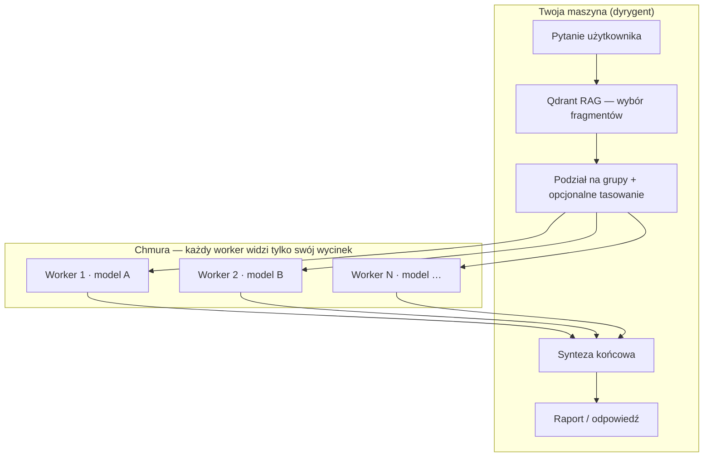

# Plan Usprawnień – AI Analiza Dokumentów

> **Roadmapa na GitHub:** [Issue #2 — Plan rozwoju 2026](https://github.com/dragon15555000/AI_analiza_dokumentow/issues/2) (tabela faz + sprinty).  
> Kopia treści issue: [`docs/ROADMAP_ISSUE_2.md`](docs/ROADMAP_ISSUE_2.md).
> **Historia zmian użytkownika:** [`CHANGELOG.md`](CHANGELOG.md).

Cel: Zwiększyć stabilność, użyteczność dla śledczych i jakość kodu — przy wielodostawcowości LLM (Ollama / OpenRouter / Groq).

---

## Plan skrócony — stan czerwiec 2026

Legenda: ✅ zrobione · 🟡 częściowo · ⬜ do zrobienia

| Priorytet | Temat | Status | Co zostaje |
|-----------|--------|--------|------------|
| **1** | Produkcyjny WSGI + stabilność uruchomienia | 🟡 | Waitress, `wsgi.py`, `ai_analiza-user.service`, `restart-app.sh --user` — **test na maszynie docelowej** + ewentualne poprawki |
| **2** | Abstrakcja LLM (chat/synteza/weryfikacja) | 🟡 | `call_llm()` / `stream_llm_tokens()` + Groq + **pool kluczy** (`EndpointPool`); zostało ~1–4 bezpośrednie `_call_ollama` poza fallbackiem (np. `/suggestions`) — **embeddingi zawsze przez Ollama, bez zmian** |
| **3** | `/tasks` + blokada ciężkich operacji | ⬜ | Kolejka / mutex wektoryzacji; endpoint statusu długich zadań |
| **4** | UX providerów (OpenRouter/Groq) | 🟡 | Flota LLM ✅; zostało: ulubione modele, badge topbar — **domknąć luki UX** |
| **5** | Timeline + eksport grafu | 🟡 / ⬜ | `/timeline` istnieje; **hardening + UX**; eksport PNG grafu do raportu — po stabilności (1–3) |
| **6** | Podgląd dokumentów w wynikach | 🟡 | `GET /api/get_context`, snippet + lazy-load — **doprecyzowanie / hardening**, nie greenfield |
| **7** | Wydzielenie modułu `llm_client` | ⬜ | Dopiero po ustabilizowaniu providerów i UI (Faza 4) |
| **8** | Cloud embeddingi (Jina / OpenRouter) | ⬜ | Opcjonalne; domyślnie nadal `nomic-embed-text` via Ollama |

### Kolejność prac (rekomendacja)

1. Dokończyć **WSGI** i stabilność uruchomienia (test prod-like).
2. Uporządkować **LLM abstraction** — tylko tor chat/synteza/weryfikacja; **nie** ruszać `get_embedding()` / importu.
3. **`/tasks`** + blokada równoległych ciężkich wektoryzacji.
4. Domknąć **UX OpenRouter/Groq** tam, gdzie są luki (ulubione modele, badge aktywnego modelu).
5. Dopiero potem: **timeline**, **eksport grafu PNG**, clustering sieci.

### Świeżo w repo (po v2026.12)

- **Flota LLM** — zakładka + ranking/sonda/auto-route; pule kluczy w `/health`
- **CHANGELOG.md** — podsumowanie sesji
- **Patch lokalnego Qdrant** — `_is_local_qdrant_url()` (bez warningów api_key / check_compatibility)
- **`scripts/run-tests.sh`** — smoke integracyjny

---

## Zrealizowane w v2026.12 (01 czerwca 2026)

**Opcja A — pełne wyciszenie błędów SQL + działający Dashboard diagnostyczny (wysoki wpływ na UX)**

- Całkowite odłączenie `sqlLoadSavedConn()` z `window.onload` i `showTab` (na wyraźne żądanie użytkownika po "A")
- Zakładka "SQL" pokazywana **wyłącznie** gdy `/sql/config` zwróci `has_config: true` (domyślnie ukryta)
- Przycisk w modalu diagnostycznym (⚙️) do ręcznego włączenia integracji przy pierwszej konfiguracji
- Bezpieczne stuby JSON dla **wszystkich** endpointów `/sql/*` wywoływanych z UI (`/test`, `/schema`, `/write`, `/vectorize*`)
- Zaimplementowano brakujący endpoint `/health` w oparciu o istniejące helpery `_check_*` + status SQL
  - Kolorowe kropki (Qdrant/LLM/OCR) działają
  - Bogaty modal startowy / diagnostyczny otrzymuje prawdziwe dane
  - Topbar (wektory, status, wersja) i polling aktualizacji działają poprawnie
- Dodano `PYMSSQL_AVAILABLE` + wspólny `_load_sql_config()`
- **Efekt**: błąd `SyntaxError: Unexpected token '<'` / "Nie udało się załadować config" **nigdy nie pojawia się** u użytkowników bez skonfigurowanego SQL Server

**Inne poprawki w tej wersji**
- Commit + tag v2026.12 + aktualizacja dokumentacji

**Wpływ**: Bardzo wysoki (kończy irytujący spam w konsoli + naprawia cały moduł diagnostyki, który był częściowo martwy)

---

## Priorytety (szczegóły)

### Faza 1 – Stabilność i podstawy (najwyższy priorytet)

**1.1 Produkcyjny serwer WSGI** 🟡 praktycznie domknięte
- [x] Dodano waitress do requirements.txt
- [x] Stworzono wsgi.py
- [x] Przygotowano ai_analiza.service + ai_analiza-user.service
- [x] Dodano instrukcję w README.md
- [x] Stworzono skrypt migrate_to_waitress.sh + restart-app.sh --user
- [ ] **Przetestować na maszynie docelowej** + ewentualne poprawki
- **Wpływ**: Bardzo duży (kończy ERR_CONNECTION_RESET)
- **Wysiłek**: Mały (głównie walidacja)

**1.2 Dokończyć migrację do abstrakcji LLM** 🟡
- **Zasada:** embeddingi i import wektorów **zawsze** przez Ollama (`get_embedding`, `get_embeddings_batch`) — te ścieżki **nie** migrują na chmurę.
- **Cel:** usunąć bezpośrednie `_call_ollama` tylko z toru **chat / synteza / weryfikacja / sugestie**; fallback Ollama przy 429 w `call_llm` zostaje.
- [x] `call_llm()`, `stream_llm_tokens()`, OpenRouter + Groq, pool kluczy
- [ ] Zamienić pozostałe obejścia (np. `/suggestions` → `call_llm` z providerem z UI)
- **Wpływ**: Wysoki (łatwiejsze utrzymanie wielodostawcowości)

**1.3 Lepsze zarządzanie ciężkimi operacjami** ⬜
- Wektoryzacja „wszystko” w tle (kolejka lub osobny wątek)
- Endpoint **`/tasks`** — status długich operacji
- Mutex: blokada równoległych ciężkich wektoryzacji
- **Wpływ**: Wysoki (aplikacja przestaje „dławić się” przy wektoryzacji)

### Faza 2 – Providerzy LLM w UI (domknięcie UX)

**2.1 Selektor modeli w UI** 🟡 częściowo zrobione
- [x] Dropdown OpenRouter + Groq, sugestie modeli per zakładka, toast „Zastosuj”
- [x] Panel config LLM, zapis do `.llm_config.json`
- [x] Zakładka **Flota LLM** — ranking dostawców (sonda, score, auto-routing); API `/api/llm/fleet*`
- [ ] Ulubione / własne modele (persist)
- [ ] Badge aktywnego modelu w topbarze (spójnie we wszystkich zakładkach)
- **Uwaga:** nie „zrobić od zera” — **domknąć luki UX**

**2.2 Obsługa osobnego modelu embeddingów** ⬜
- Opcjonalnie `OPENROUTER_EMBED_MODEL` / Jina — **poza domyślnym flow**
- Domyślnie: Ollama `nomic-embed-text` (bez zmian)
- **Wpływ**: Średni (multimodal / cloud embed — opcjonalnie)

**2.3 Liczenie kosztów / tokenów** 🟡
- [x] Liczniki tokenów przy streamingu (częściowo)
- [ ] Sesyjny licznik + dane z API chmury gdy dostępne
- **Wpływ**: Średni

### Faza 3 – Funkcje dla śledczych (po stabilności 1–3)

**3.1 Oś czasu / Timeline** 🟡 backend istnieje
- [x] Endpoint `POST /timeline`, zakładka w UI (SSE)
- [ ] Hardening ekstrakcji dat, lepsza wizualizacja D3, retry UX
- **Wpływ**: Wysoki dla śledczych — **dobry kandydat po Fazie 1**

**3.2 Eksport grafu** 🟡
- [x] Eksport SVG/CSV z sieci powiązań
- [ ] Eksport **PNG** jednym kliknięciem
- [ ] Wstawianie grafu do raportu DOCX
- **Wpływ**: Wysoki dla raportowania

**3.3 Lepsze filtrowanie w Sieci powiązań** 🟡
- [x] Siła powiązania 1–12, filtr samotnych węzłów
- [ ] Filtrowanie po zakresie dat
- [ ] Clustering węzłów
- **Wpływ**: Wysoki

**3.4 Podgląd dokumentów w wynikach** 🟡 hardening (nie greenfield)
- [x] `GET /api/get_context`, snippet w wynikach, lazy-load, filtry ext/data w `/documents`
- [ ] Spójność modalu we wszystkich zakładkach, edge cases (brak point_id, duże pliki)
- [ ] Raport: pliki zaimportowane wyłącnie przez OCR
- **Uwaga:** przeniesione z „nowa funkcja” → **doprecyzowanie**

### Faza 4 – Jakość kodu (po stabilizacji providerów)

**4.1 Wydzielenie klienta LLM** ⬜
- Moduł `llm/` lub `services/llm_client.py` — **dopiero po Fazie 1–2**
- Przenieść logikę Ollama (chat) + OpenRouter + Groq + pool
- **Wpływ**: Średni (łatwiejszy development)

**4.2 Lepsze logowanie i błędy** 🟡
- Spójne logowanie wywołań LLM (provider + model)
- Lepsze komunikaty dla użytkownika
- **Wpływ**: Średni

**4.3 Konfiguracja** 🟡
- Walidacja kluczy przy starcie, pydantic-settings (opcjonalnie)
- **Wpływ**: Niski/średni

### Faza 5 – Długoterminowe / Opcjonalne

- Docker + docker-compose (łatwiejsze wdrożenie)
- Prosty panel administracyjny / statystyki użycia
- Eksport do innych formatów (Excel, JSON z metadanymi)
- Integracja z zewnętrznymi źródłami (opcjonalnie)
- Testy automatyczne kluczowych ścieżek (szczególnie LLM + streaming)

---

## Szybkie zwycięstwa (następne 1–2 dni)

1. Test Waitress na maszynie docelowej (checklist prod z README)
2. `/suggestions` → `call_llm()` zamiast `_call_ollama` (reszta fallbacków zostaje)
3. Patch Qdrant lokalny — commit `_is_local_qdrant_url()` (jeśli jeszcze nie na master)
4. Prosty mutex na równoległą wektoryzację SQL (przed pełnym `/tasks`)
5. Badge aktywnego modelu w topbarze

---

## Uwagi

- Największy zwrot daje dokończenie **Fazy 1** (WSGI + `/tasks` + LLM cleanup bez dotykania embeddingów).
- **Embeddingi zawsze Ollama** — reguła projektu; cloud embed to osobna, opcjonalna ścieżka (2.2).
- Po stabilności: **Timeline** i **eksport PNG grafu** — wysoka wartość śledcza.
- OpenRouter + Groq + diagnostyka + WSL to mocne strony narzędzia.

---

*Plan stworzony: maj 2026*  
*Ostatnia aktualizacja planu skróconego: **czerwiec 2026** (po Flocie LLM, CHANGELOG, review priorytetów)*

---

## Zrealizowane w maju/czerwcu 2026 (po recenzji)

### Stabilność importu i wydajność
- **Naprawiono krytyczny błąd parsera Excela** — `return` w `_extract_excel` został zgubiony podczas refaktoringu (copy-paste). Import plików `.xlsx` działa ponownie.
- **Optymalizacja importu metadanych** — `extract_file_metadata()` wywoływana była w pętli batchowej → teraz pobierana jest tylko raz na plik (duża oszczędność IO przy dużych PDF-ach).
- Wyrównano `batch_size` do 6 we wszystkich ścieżkach wektoryzacji (zgodnie z intencją odciążania Ollamy w `get_embeddings_batch`).

### OpenRouter — odporność na limity darmowych modeli
- Dodano pełną obsługę 429 (retry + exponential backoff + szanowanie `Retry-After`).
- Wprowadzono czyste komunikaty `[RATE_LIMIT]` zamiast surowych wyjątków.
- Dodano opcjonalny automatyczny fallback na Ollama (`OPENROUTER_FALLBACK_TO_OLLAMA=true`).
- Weryfikacja (Krytyk) używa teraz osobnego modelu (`OPENROUTER_MODEL_VERIFY`) — zmniejsza presję na limity głównego modelu.
- Zaktualizowano domyślne modele na lepsze darmowe (Llama-3.3-70B free jako główny).
- Poprawiono przekazywanie providera do `/verify`.
- Frontend: ładne alerty z przyciskiem "Przełącz na Ollama" przy trafieniu w limit.

### Inne
- Naprawiono pliki `ai_analiza.service` i `migrate_to_waitress.sh` (pozostałości markdown ` ``` ` na końcu).
- Wyrównano wszystkie wywołania batch embeddings do `batch_size=6`.

Te zmiany znacząco zwiększają niezawodność przy korzystaniu z darmowych modeli OpenRouter.

---

## Zrealizowane – v2026.08 (lipiec 2026)

### Użyteczność i doświadczenie użytkownika
- **Dynamiczne sugestie modeli + auto-switch** — przy zmianie zakładek aplikacja inteligentnie sugeruje najlepszy model (i może automatycznie przełączać).
- **Konfiguracja przez `.env`**:
  - `EMBED_MODEL` — możliwość zmiany modelu embeddingów (domyślnie `nomic-embed-text`)
  - `OCR_LANG` — łatwa zmiana języka OCR
- **Lepsze wsparcie dla Windows + WSL**:
  - Znacznie ulepszone automatyczne wykrywanie dysków Windows (w tym dysk G: przy leniwym montowaniu w WSL)
  - Agresywne sondowanie liter dysków w `/api/drives`

### Diagnostyka i obserwowalność (duży postęp)
- Wzbogacona **Diagnostyka startowa** (modal przy uruchomieniu + przycisk ⚙️):
  - Nowy wiersz **Embedding** (pokazuje czy model embeddingów jest dostępny)
  - Znacznie lepsze, bardziej precyzyjne komunikaty błędów (np. "model nie istnieje → gotowa komenda `ollama pull`")
  - Przycisk **„📋 Kopiuj diagnostykę”** — kopiuje czytelne podsumowanie do schowka (bardzo przydatne przy zgłaszaniu problemów)
  - Wyświetlanie czasu ostatniego sprawdzenia
  - Wersja aplikacji widoczna w nagłówku modala i w topbarze
- Kolorowe kropki statusu w nagłówku (Qdrant / LLM / OCR) + automatyczne odświeżanie co 30s

### Inne
- Wersja aplikacji (`APP_VERSION`) automatycznie odczytywana z tagów git (w trybie dev pokazuje `-dirty`)

Te zmiany znacząco poprawiają codzienne doświadczenie użytkownika, szczególnie na Windows + WSL oraz przy korzystaniu z diagnostyki w razie problemów.

---

## Zrealizowane – Self-update, User Service & Developer Experience (v2026.09)

### Automatyczna aktualizacja z GitHub
- Dodano system sprawdzania i pobierania aktualizacji bezpośrednio z poziomu aplikacji:
  - Nowa sekcja **„Aktualizacje”** w modalu diagnostycznym startowym
  - Automatyczne sprawdzanie GitHub co 20 minut w tle + powiadomienie (kropka na ikonie ⚙️)
  - Przyciski: **Sprawdź aktualizacje** → **Pobierz aktualizację** → **Zrestartuj aplikację**
  - Wyświetlanie changelog bezpośrednio z GitHub Releases
- Endpointy: `/api/update/status`, `/api/update/pull`, `/api/update/restart`

### Lepsze podejście produkcyjne (systemd user service)
- Utworzono `ai_analiza-user.service` – usługa systemd działająca bez uprawnień roota
- Stworzono `install-user-service.sh` – jedno polecenie do instalacji całej usługi użytkownika
- Znacznie rozbudowano `restart-app.sh`:
  - Pełne wsparcie dla `--user` (zarządzanie user service)
  - Podkomendy: `logs`, `status`, `restart`
  - Opcjonalny `git pull` przy restarcie
- Usługa domyślnie używa **Waitress** (produkcyjny serwer) i nasłuchuje na `0.0.0.0:5000`
- Lepsze, bardziej eleganckie ładowanie zmiennych z `.env`

### Dokumentacja
- Dodano obszerną sekcję w README o uruchamianiu jako **systemd --user** (zalecany sposób na WSL/laptopach)
- Zaktualizowano `AGENTS.md` – nowe wytyczne dla AI coderów dotyczące sposobów uruchamiania aplikacji

Te zmiany znacząco podnoszą poziom „produkcyjności” lokalnego środowiska deweloperskiego, jednocześnie zachowując prostotę dla codziennej pracy.

---

## Zrealizowane – v2026.10 (Detektyw / wyszukiwanie śledcze)

- Tryb **Detektyw — briefing śledczy**: sekcje odpowiedzi, tagi anomalii, min. 12 chunków, dywersyfikacja po plikach
- **`chat_context`** oddzielnie od `query` — historia rozmowy nie psuje embeddingu RAG
- Merge PR #16, tag release `v2026.10`

---

## Zrealizowane – v2026.11 (dokumentacja, sieć D3, poprawki)

- **README / .env.example / AGENTS.md** — aktualizacja pod Detektywa, self-update, diagnostykę, sieć, Excel
- **Sieć D3**: zatrzymywanie poprzedniej symulacji, tooltips po zoom, suwak siły 1–12, filtr samotnych węzłów, eksport SVG/CSV, responsywna wysokość, panel hubów + briefing AI, wyszukiwarka węzłów, SSE postępu partii
- **Bugfix**: `fetchHealth` → `updateHealthStatus` po przełączeniu Qdrant
- **Bugfix**: `/health` — `embedding.ok` zawsze z Ollama (nawet przy OpenRouter chat)
- **Bugfix**: `systemctl --user` w statusie/restartcie usługi
- **Bugfix**: bezpieczne parsowanie `strength` w `/network`; `git pull` fallback `main`

---

## Macierz funkcji — OCR i zarządzanie plikami (Excel/PDF)

| Obszar | Stan | Priorytet | Co jest dziś | Co brakuje do 🟢 |
|--------|------|-----------|--------------|------------------|
| **OCR (lepsze)** | 🟡 Częściowo | Średni | Fallback Tesseract `pol` dla skanów PDF (&lt;20 znaków) i obrazów; status w `/health` → `ocr` | Wymuszony OCR w UI, postęp per strona, `eng+pol`, preprocessing, podgląd skanu w wynikach |
| **Zarządzanie zasobami plików (Excel/PDF)** | 🟡 Częściowo | Wysoki | Import XLSX (arkusze, formuły, forensyka), PDF tekstowy, metadane, przeglądarka dokumentów, bulk delete | Podgląd fragmentu w wynikach, filtry po typie/dacie, raport „import bez tekstu (tylko OCR)” |

**Sprawdzenie w runtime:** `curl -s http://127.0.0.1:5000/health | python3 -m json.tool` — pola `ocr`, `file_parsers`.

**Instalacja OCR (dev):** README → sekcja „OCR”; checklista przy starcie aplikacji w UI.

### Proponowane zadania (backlog)

**OCR**
- [ ] Checkbox „Wymuś OCR” przy imporcie folderu
- [ ] SSE: postęp `ocr_page` / `ocr_done` dla wielostronicowych PDF
- [ ] Rozszerzyć `lang` na `pol+eng` (konfiguracja w `.env`)
- [x] Komunikat w UI gdy `ocr.available === false` (z `install_hint`) — kropka ⬤ OCR w topbarze, tooltip z komendą instalacji

**Excel/PDF**
- [x] Rozszerzona forensyka Excel (metadane, AVERAGE/SUM, błędy #REF!, ukryte arkusze, rekomendacje w UI) — 2026-06
- [x] Podgląd fragmentu (`/api/get_context`, lazy-load) — 2026-06; dalszy **hardening** → 3.4
- [x] Filtr w przeglądarce dokumentów: typ pliku, data modyfikacji
- [ ] Endpoint lub raport: lista plików zaimportowanych wyłącznie przez OCR

*Ostatnia aktualizacja macierzy: **czerwiec 2026** (review planu + Flota LLM)*

---

## Bank pomysłów — wizja produktu

### Pomysł #30 · Lokalny dyrygent + roj darmowych LLM (fragmentacja dokumentu)

**Pytanie:** Czy da się zrobić agenta lokalnego, który bierze zadanie (np. przepłaty w dokumentach, szukanie powiązań, ocena rozdziału pracy), **dzieli dokument na fragmenty**, wysyła każdy fragment do **innego darmowego modelu online**, a na końcu **zbiera wyniki** — tak żeby **żaden model w chmurze nie widział całego dokumentu**?

**Odpowiedź: tak — i częściowo już to działa w aplikacji.**

#### Idea w skrócie

| Rola | Gdzie działa | Co widzi | Co robi |
|------|--------------|----------|---------|
| **Dyrygent (lokalny)** | Flask na Twoim PC / WSL | Cały indeks Qdrant, metadane, pełne chunki | Wyszukuje fragmenty (RAG), tasuje i dzieli, uruchamia workery równolegle, składa syntezę |
| **Worker 1…N (online)** | Groq / OpenRouter / Ollama | Tylko 3–6 chunków (~1200 znaków każdy) | Ekstrahuje fakty, osoby, daty, kwoty, luki |
| **Synteza (lokalnie sterowana)** | Ten sam dyrygent | **Nie** pełny dokument — tylko streszczenia workerów | Łączy wnioski, rozwiązuje sprzeczności, zwraca raport |



#### Co już jest w kodzie (czerwiec 2026)

- **Endpoint:** `POST /agents/swarm` (SSE)
- **UI:** zakładka **Rój agentów** — tryby **A · Incognito / B · Szybkość / C · Jakość**
- **Tryb A (Incognito)** — najbliżej wizji użytkownika:
  - tasuje fragmenty przed podziałem (`shuffle_chunks: true`)
  - losuje modele między workerami (`random_models: true`)
  - każdy worker dostaje prompt: *„Dostajesz tylko wycinek dokumentów”*
- **Map-reduce:** N workerów równolegle (`ThreadPoolExecutor`) → jedna synteza końcowa
- **Źródła:** fragmenty z Qdrant (tryb detektyw — min. dywersyfikacja po plikach)
- **Provider:** OpenRouter / Groq / Ollama + pool kluczy (`EndpointPool`)

#### Przykładowe zadania (szablony pod rozszerzenie)

| Zadanie | Pytanie do roju | Co wyciągają workery | Co robi synteza |
|---------|-----------------|----------------------|-----------------|
| **Przepłaty / faktury** | „Wskaż podejrzane przepłaty, duplikaty kwot, rozbieżności NIP–kwota” | Kwoty, daty, kontrahenci z fragmentów | Lista incydentów + priorytet |
| **Powiązania osób–firm** | „Kto występuje razem z kim i w jakim kontekście?” | Osoby, role, daty | Graf logiczny / tabela hubów |
| **Ocena rozdziału pracy** | „Oceń spójność metodologii, brakujące cytowania, luki argumentacji” | Tezy, definicje, odwołania z sekcji | Werdykt + lista uwag merytorycznych |
| **Audyt umowy** | „Wypisz klauzule wysokiego ryzyka i niespójności między załącznikami” | Paragrafy, kwoty, terminy | Checklist ryzyk |

#### Granice prywatności (uczciwie)

- **Plus:** Żaden pojedynczy request do Groq/OpenRouter **nie zawiera całego dokumentu** — tylko wycinek + pytanie.
- **Minus:** Synteza widzi **streszczenia wszystkich workerów** (może zawierać łącznie dużo treści). Przy bardzo wrażliwych sprawach: synteza na **Ollama lokalnie**, workery w chmurze.
- **Minus:** Dostawca chmury nadal widzi **fragment**, który wysyłasz — to nie jest szyfrowanie E2E; to **minimalizacja ekspozycji**, nie zerowa wiedza.

#### Co można dodać (roadmap pod #30)

| Etap | Opis | Priorytet |
|------|------|-----------|
| **30.1** | Szablony zadań w UI (przepłaty / praca dyplomowa / umowy) — predefiniowane prompty + tryb A | Wysoki |
| **30.2** | **Redakcja przed wysyłką** — maskowanie PESEL/NIP/rachunków w chunku wysyłanym do chmury | Wysoki |
| **30.3** | Synteza **tylko lokalnie** (Ollama), workery w chmurze — przełącznik „strict incognito” | Średni |
| **30.4** | Worker zwraca **JSON strukturalny** (daty, kwoty, encje) → łatwiejsze łączenie i timeline | Średni |
| **30.5** | **Krytyk** na końcu — drugi lokalny pass weryfikuje syntezę vs oryginalne chunki (bez ponownego wysyłania całości) | Średni |
| **30.6** | Eksport raportu roju do DOCX (jak w wyszukiwaniu) | Niski |
| **30.7** | Rotacja providerów **per worker** (worker 1 → Groq, worker 2 → OpenRouter free) — jeszcze trudniejsze skorelowanie | Niski |

#### Jak uruchomić dziś

1. Zaimportuj dokumenty do Qdrant (import folderu).
2. Otwórz zakładkę **Rój agentów**.
3. Wybierz **A · Incognito**.
4. Wpisz pytanie (np. *„Wskaż przepłaty i rozbieżności kwot między fakturami”*).
5. Uruchom — obserwuj postęp workerów i finalną syntezę.

**Status pomysłu:** 🟡 **Rdzeń zaimplementowany** (`/agents/swarm`); do pełnej wizji brakuje szablonów zadań, redakcji PII i trybu „synteza tylko lokalnie”.

---

## Końcowa recenzja kodu (01.06.2026)

Na prośbę użytkownika przeprowadzono pełną końcową recenzję kodu całej aplikacji.

**Wykonane działania i poprawki:**
- Dodano nową zakładkę „Raporty śledcze” z 8 gotowymi szablonami demonstracyjnymi możliwości programu.
- Wprowadzono podstawowe przetwarzanie partiami w `build_network()` (partie po 5 dokumentów) + licznik przetworzonych partii.
- Ulepszono komunikaty błędów przy budowaniu sieci powiązań.
- Dodano/ulepszono globalny licznik tokenów w topbarze oraz lepsze liczniki przy odpowiedziach LLM.
- Zwiększono widoczność pasków postępu przy imporcie/wektoryzacji.
- Dodano toast/powiadomienie po udanej aktualizacji z GitHub.
- Poprawiono skrypty `start`, `stop`, `restart-app.sh` i `install-user-service.sh` (kolorowe komunikaty, git pull przy starcie).
- Dodano zarządzanie App API Key w ustawieniach UI.
- Zmieniono domyślny provider LLM na OpenRouter (oprócz importu/embeddings).
- Zaktualizowano dokumentację (README, AGENTS.md, IMPROVEMENT_PLAN.md).
- Przeprowadzono końcową pełną recenzję kodu i naprawiono pozostałości po wcześniejszych refaktoryzacjach.

**Data zakończenia recenzji:** 01 czerwca 2026

### Sieć powiązań — naprawa i rozbudowa (czerwiec 2026, v2026.12)

- **Bugfix**: `/network` zwracał HTML/404 zamiast danych — brak `return Response(SSE)`; frontend parsował HTML jako JSON (`Unexpected token '<'`).
- **Backend**: pełny prompt ekstrakcji encji, przetwarzanie partiami (5 dokumentów), `_aggregate_network_edges()`, `_network_graph_stats()`, `_network_ai_briefing()`.
- **Frontend**: `streamSSEPost()` + `fetchJson()`, pasek postępu SSE, panel analityczny (huby, typy, daty), briefing AI, wyszukiwarka węzłów, eksport CSV, 2 nowe scenariusze (niespójności, powiązania kapitałowe).

Wszystkie większe zmiany są udokumentowane w commitach tej sesji.
